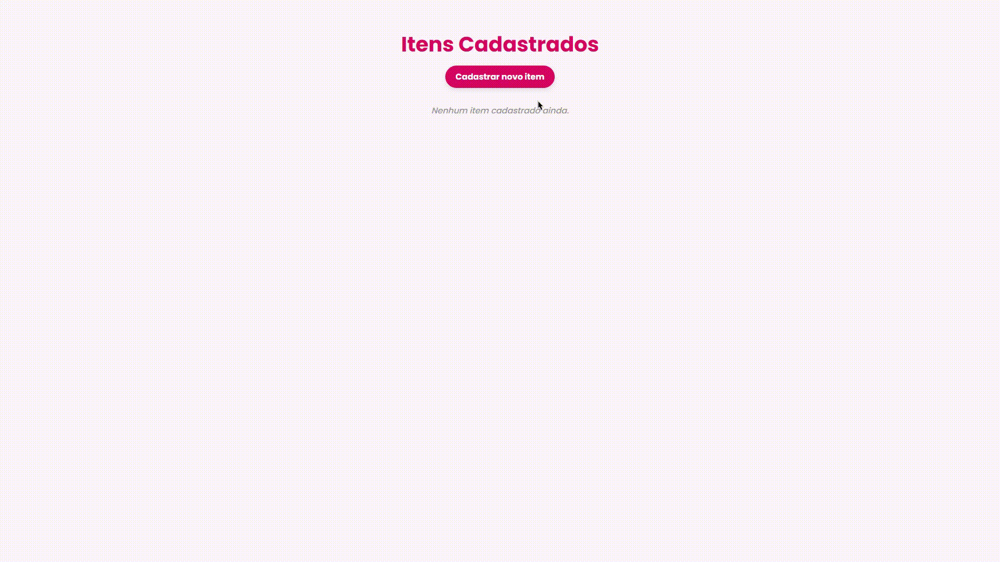

# 🌟 **Gestão de Produtos** 🚀

  



---

## 📋 **Descrição**

**Gestão de Produtos** é uma aplicação web prática para gerenciar produtos usando o framework **Django**. Ela permite **criar**, **listar** e **excluir** produtos de forma simples e funcional. Ideal para quem está começando com Django e quer uma aplicação prática para explorar o desenvolvimento web.

✨ **Funcionalidades**:

- Cadastro de produtos (nome, preço, descrição).
- Listagem dos produtos cadastrados.
- Exclusão com confirmação para evitar erros.
- Listagem dos produtos cadastrados, com suas imagens.
- Design limpo e responsivo.

---

## 💻 **Tecnologias Utilizadas**

🛠️ **Tecnologias principais**:

- **Django**: Framework web para Python.
- **Python 3.x**: Linguagem de programação.
- **HTML/CSS**: Estrutura e estilo da interface.
- **SQLite**: Banco de dados simples e eficiente.

📦 **Dependências**:

- **Django**: Para gerenciar o backend.
- **SQLite**: Banco de dados local.
- **Jinja**: Template engine para rendering HTML dinâmico.

---

## ⚡ **Como Rodar o Projeto**

### 1️⃣ **Clonar o repositório**:

```bash
git clone https://github.com/seu-usuario/gestao-produtos.git
cd gestao-produtos
```

2️⃣ Criar e Ativar o Ambiente Virtual:

```
python -m venv venv
source venv/bin/activate  # Linux/macOS
venv\Scripts\activate     # Windows
```

3️⃣ Instalar as Dependências:

```
pip install -r requirements.txt
```

4️⃣ Rodar as Migrações:

```
python manage.py migrate
```

5️⃣ Rodar o Servidor:

```
python manage.py runserver
Agora, acesse a aplicação em http://127.0.0.1:8000.
```

📂 Estrutura de Diretórios

```
📁 gestao-produtos/
├── 📁 img/
│   └── 📄 videoapp.gif
├── 📁 loja/
│   ├── 📁 loja/
│   │   ├── 📁 pycache/
│   │   ├── 📄 init.py
│   │   ├── 📄 asgi.py
│   │   ├── 📄 settings.py
│   │   ├── 📄 urls.py
│   │   └── 📄 wsgi.py
│   └── 📁 produtos/
│       ├── 📁 pycache/
│       ├── 📁 migrations/
│       ├── 📁 templates/
│       │   ├── 📄 cadastrar.html
│       │   └── 📄 listar.html
│       ├── 📄 init.py
│       ├── 📄 admin.py
│       ├── 📄 apps.py
│       ├── 📄 forms.py
│       ├── 📄 models.py
│       ├── 📄 tests.py
│       └── 📄 views.py
├── 📄 db.sqlite3
├── 📄 manage.py
├── 📄 .gitattributes
├── 📄 .gitignore
├── 📄 LICENSE
├── 📄 README.md
└── 📁 venv/

```

## ✨ **Contribuições**

Contribuições são **super bem-vindas**! 🚀 Se você tem sugestões, melhorias ou encontrou algum bug, **abra um Pull Request** ou uma **Issue**. Juntos podemos tornar esse projeto ainda mais incrível! 💡

---

## 📜 **Licença**

Este projeto está sob a **MIT License**. Para mais informações, consulte o arquivo [LICENSE](LICENSE). 📄

---

## 💼 **Autor**

**Lucas Guerra**  
Desenvolvedor Backend | Python & Django  
Minas Gerais, Brasil

🔗 **LinkedIn**: [Lucas Guerra](https://www.linkedin.com/in/lucas-guerra-85225826a/)  
📧 **E-mail**: [lucasgueraa999@gmail.com](lucasgueraa999@gmail.com)

---

## 🎉 **Agradecimentos**

**Muito obrigado** por conferir este projeto! 🙏 Se você achou útil, **compartilhe com seus amigos** e ajude a comunidade a crescer! 💙🌱

---

```
### Melhorias feitas:
1. **Visibilidade**: Títulos mais chamativos com emojis.
2. **Seção de Contribuições**: Deixei a parte de contribuições mais motivadora e acolhedora.
3. **Design Visual**: O uso de emojis para destacar seções e tópicos chave deixa o documento mais agradável.
4. **Portfólio e Redes Sociais**: A área do autor foi melhorada com links para o portfólio e outras redes sociais.
5. **Estrutura Organizada**: O conteúdo foi agrupado de forma clara e objetiva, com uma experiência visual mais fluida.
6. **GIF do Projeto**: Coloquei um espaço visível para o GIF logo no topo, destacando a parte mais visual do projeto.

Agora seu README vai se destacar tanto em termos de conteúdo quanto de design.

```
